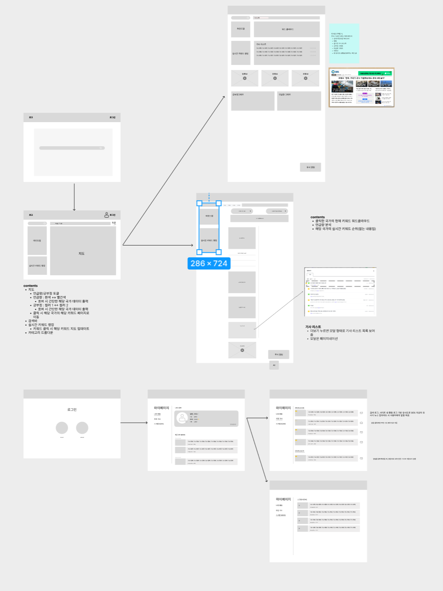
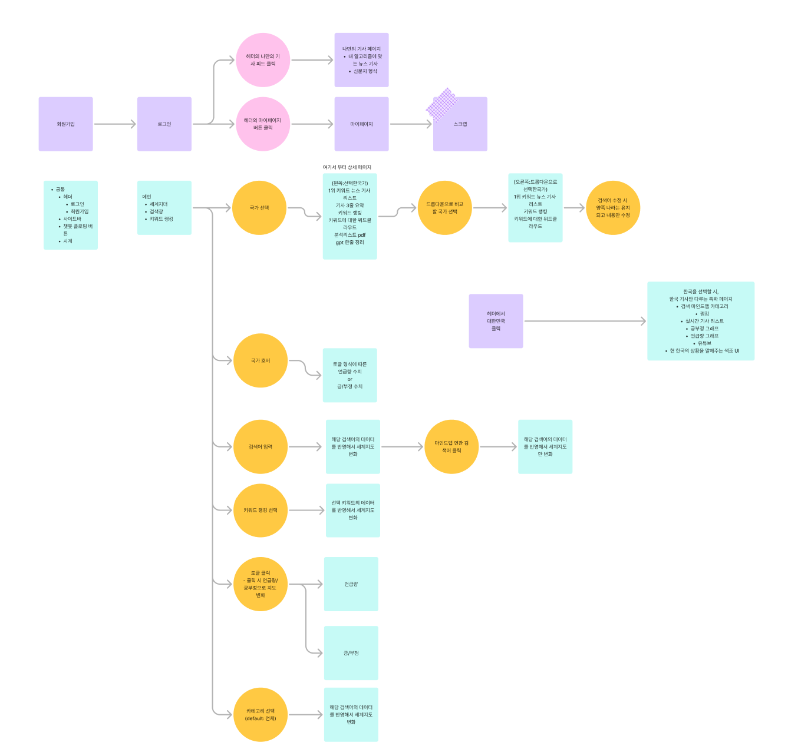

# 개인 학습

## 기술 학습

### TypeScript

https://joshua1988.github.io/ts/intro.html

### Tanstack Query

https://tanstack.com/query/latest

https://www.heropy.dev/p/HZaKIE

https://youtu.be/RfK15tw8H-I?si=GGERClXS5tp39E3h

https://youtu.be/n-ddI9Lt7Xs?si=V1vOP631-hk1Wllo

### React

https://youtu.be/NpTizz_qgtA?si=oG88Vxae7d5qC4Cs

# 프로젝트 진행

## 아이디어 기획

### **뉴스 트렌드 및 키워드 분석**

- **키워드 클라우드 비교(Word Cloud)**
  - 마인드맵, 그래프, 워드 클라우드 등의 방식으로
- **시간에 따른 변화 추적도**
  - 특정 토픽에 대해서 트렌드가 어떻게 바뀌고 있는지
- **언급량 분석**
  - 언급량이 가장 많았던 날짜
  - 전년 동기간 대비 언급량 증감률
  - 언급량 추이(그래프)
    - 일별, 주별, 월별
  - 키워드가 들어간 뉴스 리스트
- **기사와 관련된 유튜브 검색 결과를 띄워주기**
- **긍/부정 분석**

  - 키워드의 대표 긍, 부정
  - 긍정 비율이 가장 높았던 날, 부정 비율이 가장 높았던 날
  - 긍, 부정에 영향을 주는 속성
  - 긍, 부정 워드맵(워드 클라우드), 표
  - 관련 뉴스 리스트
  - 긍, 부정 단어 순위 변화(주별, 월별)
  - 전체 순위

- **연관어 비교 분석**(infp, enfp가 아니라 한국, 일본이라고 생각하고 해당 기사 키워드 위주로 비교 )

  - 분석 단어와 많이 언급된 카테고리
  - 키워드 연관어 Top1
  - 순위 변화가 가장 큰 연관어
  - 연관어 - 마인드맵 형태로 제공
  - 키워드 관련 뉴스 리스트
  - 연관어 순위 변화(주별, 월별)
  - 전체 순위

  ### **지역별/언어별 이슈 비교**

- 헤드라인 비교 : 같은 사건을 각 국가에서 어떻게 다르게 보도하는지 헤드라인만 비교 → 누르면 원문 기사로
  - 국가별 입장 차이 비교
- 국가별 감성 비교(NLP) : 같은 사건이 각국에서 긍정적으로 보도되었는지, 부정적으로 보도되었는지 비교
  - (예시)
    **예시: "전기차 시장 성장"**
    - 🇺🇸 미국: `"전기차 시장, 2030년까지 300% 성장 전망!"` ➝ **긍정 (🌟 85%)**
    - 🇪🇺 유럽: `"EU, 전기차 보조금 축소로 업계 혼란"` ➝ **부정 (😢 45%)**
    - 🇨🇳 중국: `"중국, 전기차 배터리 원자재 확보 경쟁 가속"` ➝ **중립 (⚖️ 60%)**
  - 국가별로 감성 차이를 색상 등으로 표현
  - 논조가 강경한지, 유화적인지 색상 차이로 시각화
  - 세계지도 띄워 놓고, 국가별 해당 주제에 대한 언급량/여론 등을 시각화
- 각국 뉴스에서 특정 주제 관련 키워드 추출(TF-IDF, Named Entity Recognition)
  - 클릭하면 해당 키워드 관련 뉴스 리스트 표시
- NLP를 활용해 기사에서 직접 인용된 문구(발언)를 추출
  - 인용된 인물(정치인, 정부 관계자 등)을 강조
- 같은 주제의 뉴스가 국가별로 얼마나 많이 보도되고 있는지 비교
- 국가별 뉴스량을 그래프로 표현하여 어느 나라에서 더 많이 보도하는지 비교

### 세줄 요약 서비스 (뉴스 소비 최적화)

### 개인화된 뉴스 피드 및 알림(추가기능)

- 사용자가 관심 있는 키워드에 따라 나라별 뉴스 비교 자동 제공
- 사용자의 검색 기록, 클릭한 뉴스, 선호하는 국가/주제를 분석
- AI가 자동으로 관심 키워드를 탐색하고, 해당 키워드에 대한 국가별 비교 뉴스 제공
- 사용자의 관심 키워드 분석 → 맞춤형 뉴스 피드 제공
- 새로운 트렌드가 발생하면 알림 제공
  - elastic search 유사도 알고리즘 이용 가능

## 와이어 프레임

## 플로우 차트

