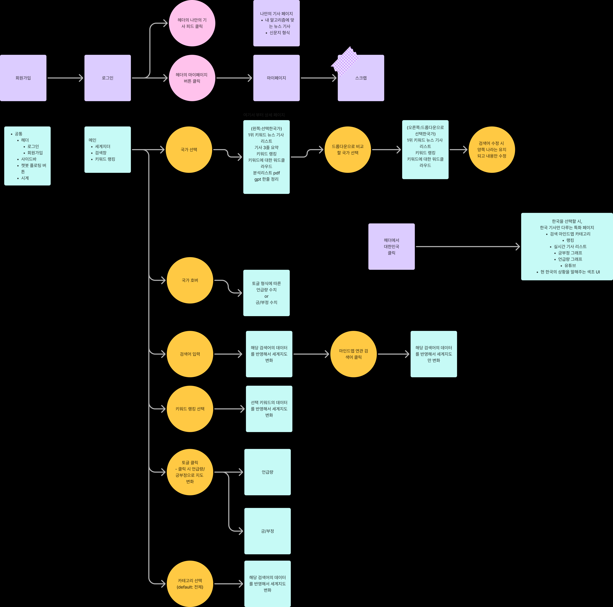

# 2025-03-07
## 개인 학습 내용
### REACT 
- [솔로스타의 React 렌더링](https://youtu.be/eBDj0B0HbEQ?si=q_eOd7SOesfl7Uk7)
- [슬링키의 브라우저 렌더링 파이프라인](https://youtu.be/idgsruQl9f4?si=ZKjXka4gE6WMngLI)

### Tanstack Query
- [시모의 TanStack Query](https://youtu.be/RfK15tw8H-I?si=kUePbR7v8CE7zPpH)
- [가람, 도리의 Tanstack Query v5 (React Query)](https://youtu.be/n-ddI9Lt7Xs?si=68tsULdbpNBGIEN4)

### TypeScript
- [TypeScript #1 타입스크립트를 쓰는 이유를 알아보자 - 타입스크립트 강좌](https://youtu.be/5oGAkQsGWkc?si=YLdoeD0vPD_HdqeU)
- [TypeScript #2 기본 타입 - 타입스크립트 강좌](https://youtu.be/70w82P-KiVM?si=vy_Mf0KSiIij-2Wn)
- [TypeScript #3 인터페이스(interface) - 타입스크립트 강좌](https://youtu.be/OIMPLNICzoc?si=sisRxh0-Nq7VSCMP)
- [TypeScript #4 함수 - 타입스크립트 강좌](https://youtu.be/prfgfj03_VA?si=XdczysYHb2LFwllt)
- [TypeScript #5 리터럴, 유니온/교차 타입 - 타입스크립트 강좌](https://youtu.be/QZ8TRIJWCGQ?si=n5gJHQSVV8E1BSZD)
- [TypeScript #6 클래스 Class](https://youtu.be/17Oh028Jpis?si=DcgOQKemZp44v1Yr)
- [TypeScript #7 제네릭 Generics](https://youtu.be/pReXmUBjU3E?si=s7Vgu_TBOjGFeZmh)
- [TypeScript #8 유틸리티 타입 Utility Types](https://youtu.be/IeXZo-JXJjc?si=SNUoYzRGkhdGauMS)

---
## 기획 - 내가 낸 아이디어 
### **금융 사기 탐지 시스템 - 이아영**

> Spark & 머신러닝을 활용한 이상 금융 거래 탐지 시스템
> 

### **핵심 기능 및 차별점**

- **이상 거래 감지:** 카드 도용, 자금 세탁, 비정상적인 계좌 이체 탐지
- **실시간 알림:** 사용자의 계좌에서 고위험 거래 발생 시 즉시 알림 전송
- **머신러닝 기반 사기 탐지:** Spark ML을 활용하여 사용자별 정상적인 거래 패턴을 학습 후 이상 거래 탐지
- **자동 리포트 생성:** 금융 기관이 참고할 수 있도록 **이상 거래 상세 리포트 자동 생성**
- **이상 거래 행동 패턴 시각화:** 위험 거래 히트맵 및 네트워크 그래프 제공

### **주요 기술 스택**

- **백엔드:** Java (Spring Boot), Apache Kafka, Apache Spark ML
- **데이터 저장:** PostgreSQL, HDFS / Amazon S3
- **프론트엔드:** React, D3.js
- **데이터 분석:** Apache Spark, Scikit-learn, Isolation Forest, AutoEncoder

### **예상 구현 난이도**: ⭐⭐⭐⭐⭐ (고급)

- **이상 거래 탐지 모델 구축**이 까다로울 수 있음
- 실시간 거래 데이터를 **Kafka를 통해 Spark로 처리하는 분산 시스템 구축**
- Spark ML을 활용한 **이상 탐지 알고리즘 구현** 필요

---

### **실시간 금융 데이터 분석 및 대시보드 - 이아영**

> Spark & Kafka 기반 실시간 금융 데이터 모니터링 시스템
> 

### **핵심 기능 및 차별점**

- **실시간 금융 데이터 수집:** 주식, 암호화폐, 금리, 환율 변동 데이터를 실시간으로 수집 및 분석
- **대시보드 시각화:** 금융 데이터를 차트 및 그래프로 제공
- **사용자 맞춤형 알림:** 특정 금융 상품(주식, 채권, 금리 등) 변동이 발생하면 알림 제공
- **이벤트 기반 트리거:** 예를 들어, 특정 주식 가격이 사용자가 설정한 가격을 초과하면 푸시 알림 전송
- **Spark ML을 활용한 금융 트렌드 분석:** 과거 데이터를 기반으로 시장 흐름 예측

### **주요 기술 스택**

- **백엔드:** Java (Spring Boot), Apache Kafka, Apache Spark Streaming
- **데이터 저장:** HDFS / Amazon S3, PostgreSQL
- **프론트엔드:** React, D3.js
- **데이터 분석:** Apache Spark, TensorFlow, Pandas

### **예상 구현 난이도**: ⭐⭐⭐⭐⭐ (고급)

- **Kafka를 통한 실시간 데이터 스트리밍** 처리 및 Spark와 연동 필요
- **Spark ML을 활용한 트렌드 분석 모델 개발**
- **웹 소켓(WebSocket)을 통한 실시간 데이터 업데이트**

---

### **암호화폐 트랜잭션 분석 시스템 - 이아영**

> Spark 기반 블록체인 데이터 분석 시스템
> 

### **핵심 기능 및 차별점**

- **암호화폐 트랜잭션 분석:** 블록체인 네트워크에서 발생하는 트랜잭션 데이터 수집 및 분석
- **이상 거래 탐지:** 비정상적인 대량 송금, 자금 세탁 가능성이 있는 패턴 식별
- **실시간 대시보드:** 트랜잭션 규모, 주요 암호화폐의 거래량 변동 시각화
- **거래 내역 추적:** 특정 계정의 거래 내역 및 패턴 제공

### **주요 기술 스택**

- **백엔드:** Java (Spring Boot), Web3.js, Apache Spark Streaming
- **데이터 저장:** MongoDB, HDFS / Amazon S3
- **프론트엔드:** React, Chart.js
- **데이터 분석:** Apache Spark, Blockchain API, Scikit-learn

### **예상 구현 난이도**: ⭐⭐⭐⭐⭐ (고급)

- **블록체인 API(Web3.js, Ethers.js)를 활용한 데이터 수집** 필요
- Spark를 활용한 **대규모 트랜잭션 데이터 분석**
- **이상 거래 탐지를 위한 머신러닝 모델** 구축

---
### **카드 소비 패턴 분석 & 절약 추천 서비스 - 이아영**

> 개인 맞춤형 소비 분석 및 금융 관리 플랫폼
> 

### **핵심 기능 및 차별점**

- **소비 패턴 분석:** 사용자의 카드 결제 내역을 분석하여 카테고리별 지출 패턴 제공
- **소비 절약 추천:** 머신러닝을 활용해 비슷한 소비 패턴을 가진 사용자 그룹과 비교하여 절약 가능 지출 항목 추천
- **월간 소비 리포트:** 사용자의 월별 소비 습관을 분석하여 인사이트 제공
- **예산 관리:** 사용자가 설정한 예산 대비 실제 소비 데이터 시각화
- **실시간 소비 알림:** 사용자의 특정 카테고리(예: 외식, 쇼핑 등) 지출이 급증하면 경고 알림 제공

### **주요 기술 스택**

- **백엔드:** Java (Spring Boot), Apache Spark ML, Apache Kafka
- **데이터 저장:** PostgreSQL, HDFS / Amazon S3
- **프론트엔드:** React, Chart.js
- **데이터 분석:** Apache Spark, Pandas, Scikit-learn

### **예상 구현 난이도**: ⭐⭐⭐⭐ (중~고급)

- 카드사 API 또는 은행 API에서 **소비 데이터를 수집**하는 과정이 복잡할 수 있음
- Apache Spark를 이용한 **소비 패턴 분석 및 머신러닝 추천 모델 구현** 필요
- 실시간 소비 알림을 위한 **Kafka 스트리밍 처리** 필요

---
## 플로우 차트

## 와이어 프레임
